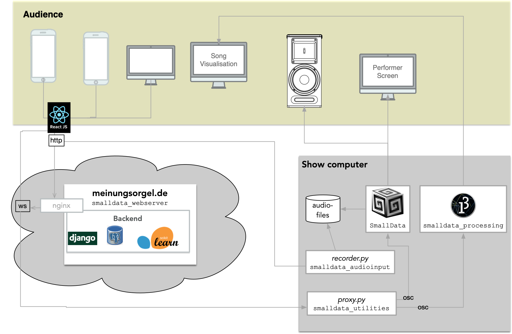

# Meinungsorgel
The __Meinungsorgel__ is an infrastructure to translate discussions into sound. This is achieved by an 
interplay of various applications, hosted in different git-repositories:
 -  [`smalldata_webserver`](https://github.com/Regexose/smalldata_webserver) contains the django/ReactJS-webserver that is used
 to collect utterances from the audience, classify them into the five available categories, and forward the results
to the next processing steps.
 - [`smalldata_utilities`](https://github.com/Regexose/smalldata_utilities) contains a collection of helper-scripts, most notably
 __proxy.py__, which is used to receive the classified utterances from the webserver (via websockets) and forward them (via osc)
to the sound generator and the visualizer.
- [`SmallData`](https://github.com/Regexose/SmallData) contains the SuperCollider-code used to generate the sound and provide
GUIs for the Meinungsorganist and MC.
- [`smalldata_processing`](https://github.com/Regexose/smalldata_processing) contains the Processing-code used to generate a visual representation 
of the discussion.
- [`smalldata_audiorecorder`](https://github.com/Regexose/smalldata_audiorecorder) contains the script __recorder.py__ to record
spoken utterances, and the Arduino-code for the button to start/stop the audio-recording 

